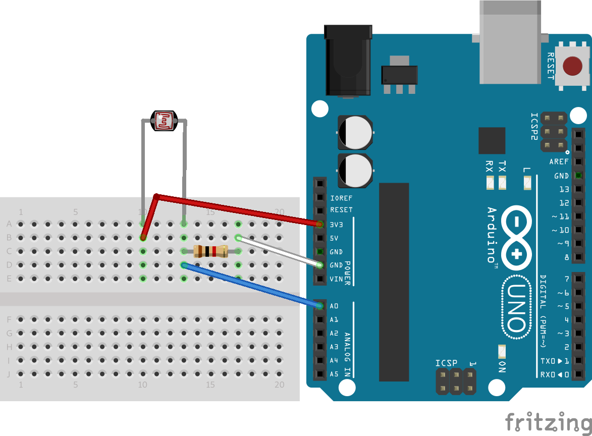

# Photoresistor
## Captar pulsos de luz en código morse usando un fotorresistor

## Materiales
- 3 cables de protoboard macho-macho
- 1 protoboard, puede ser chiquita
- 1 fotorresistor
- 1 resistencia de 1KΩ
- 1 Arduino UNO / NodeMCU

## Esquema

Descripción completa en https://mokocchi.github.io/arduino/2022/03/28/Morse-I.html.